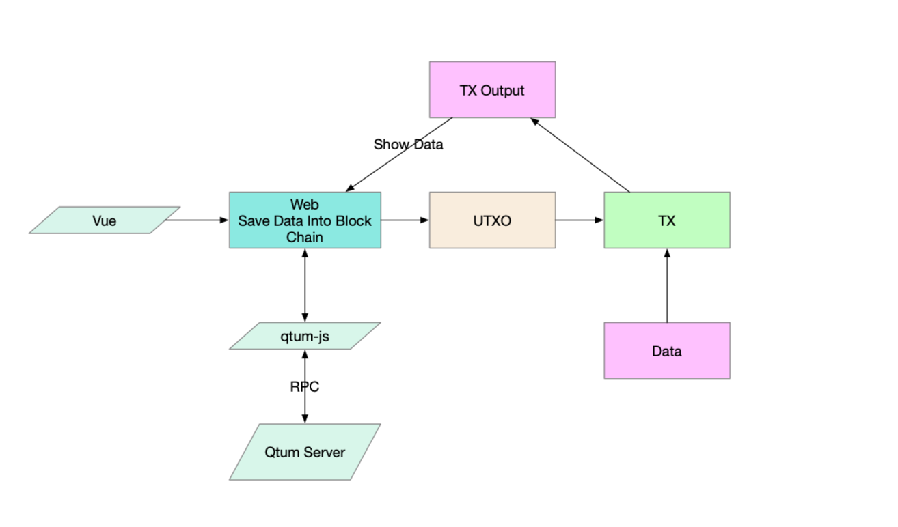

#区块链存储数据使用说明

##原理
在Qtum上的transaction output本身可以用来存储交易数据，但是在之后的升级中，扩充了对于数据长度的限制，达到80Bytes，因此就可以用来传输数据了。并且给与这些非transaction的数据，一个统一的type：OP_RETURN

##步骤一：获得UTXO

##步骤二：获取数据

##步骤三：生成完整的Transaction

##步骤四：发送Transaction
